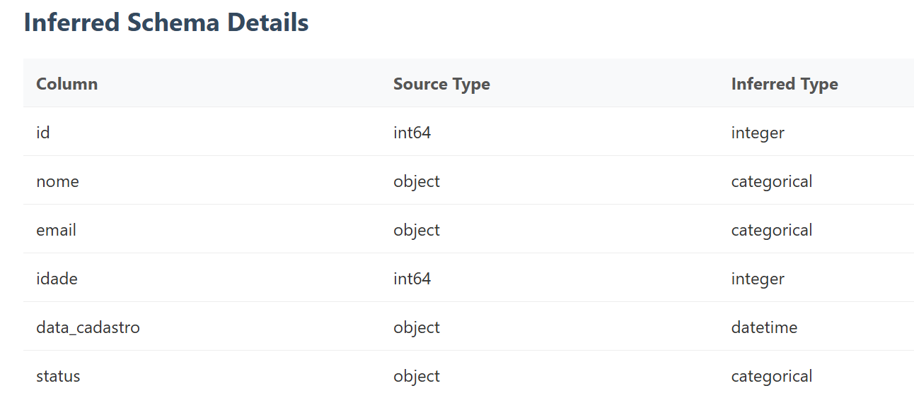
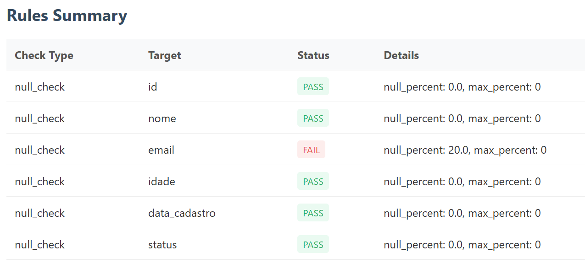
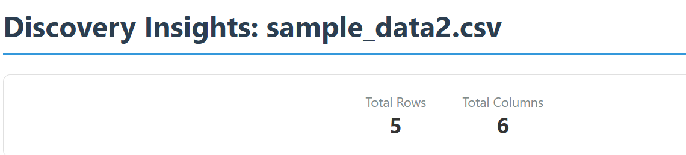
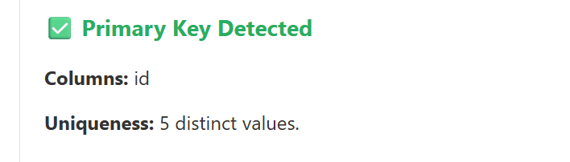
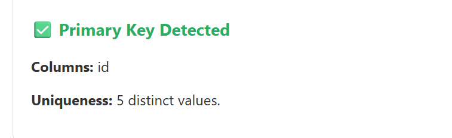
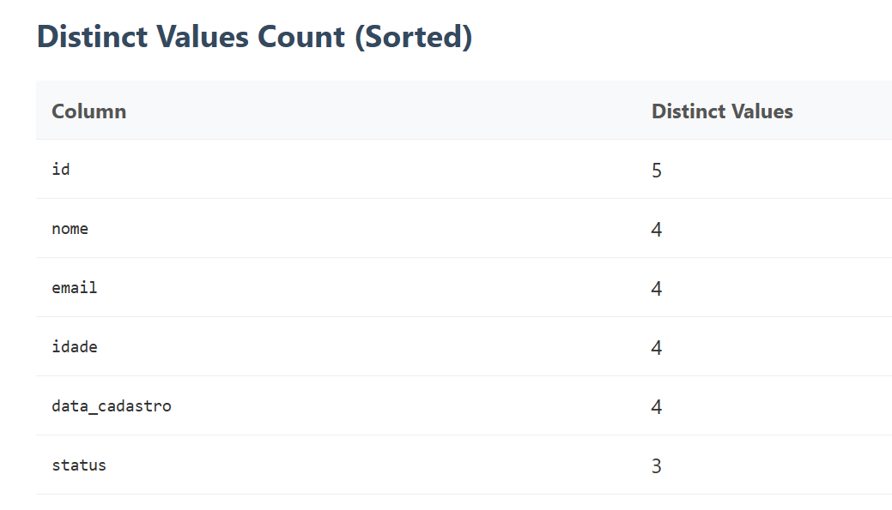

#schema
## Schema Analysis
Schema Analysis: sample_data2.csv

## status
Status: PASS

## Schema Drift
No drift detected. Dataset matches expected schema.

## Inferred Schema Details
Column, Source Type, Inferred Type

# Validations
a aba Validations foca na "saúde" e conformidade (nulos, valores fora de faixa, etc). 
## Data Quality Report: 
Data Quality Report: sample_data2.csv

DQ Score: 85.71%

## Rules Summary
Queremos saber o percentual de nulos por colunas

Check Type, Target, Status, Details

# Discovery
 A aba Discovery deve focar na "arquitetura" do dado (chaves, tipos, volume total)

total rows, total columns
Queremos saber o total de linhas e colunas

a incluir
dedupExcludColuns
A ser definido no arquivo seu_json.json para chegar duplicados considerando o conjuntotodas as colunas da tabela exceto as informadas no dedupExcludColuns

dedupIncludColumns
A ser definido no arquivo seu_json.json para checar duplicado considerando apenas o conjunto das colunas informadas no dedupIncludColumns

## Primary Key Detection
Queremos saber as possiveis colunas candidatas a chave primaria

### Primary Key Detected

### Distinct Values Count (Sorted)

