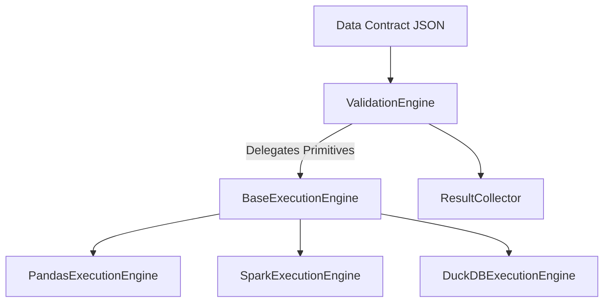

# Guia de Extensibilidade: Multi-Engine Architecture 🚀

O **SentinelGate** foi redesenhado (v3.5+) para ser agnóstico ao motor de processamento. Este documento descreve como implementar novos motores (Ex: Spark, DuckDB, Polars) para lidar com volumes massivos de dados.

## 🏗️ O Conceito: Desacoplamento de Primitivas

A `ValidationEngine` não manipula mais DataFrames diretamente. Ela delega operações de dados para um `ExecutionEngine`.



## 🛠️ Como Implementar um Novo Motor

Para adicionar suporte a um novo backend, você deve herdar de `sentinel_gate.engines.base.BaseExecutionEngine` e implementar os métodos obrigatórios.

### 1. Primitivas Necessárias
Todo motor deve saber responder:
- `get_row_count()`: Total de linhas do dataset.
- `get_columns()`: Lista de nomes de colunas.
- `get_dataframe()`: O objeto de dados original (para filtros complexos).

### 2. Exemplo: DuckDB (Para performance em arquivos locais)
O DuckDB é excelente para processar arquivos Parquet ou CSV gigantes sem carregar tudo na RAM.

```python
from sentinel_gate.engines.base import BaseExecutionEngine

class DuckDBExecutionEngine(BaseExecutionEngine):
    def __init__(self, connection, table_name: str):
        self.conn = connection
        self.table = table_name

    def get_row_count(self) -> int:
        return self.conn.execute(f"SELECT count(*) FROM {self.table}").fetchone()[0]

    def get_columns(self) -> list:
        return [desc[0] for desc in self.conn.execute(f"SELECT * FROM {self.table} LIMIT 0").description]
```

## 🚀 Roadmap de Engines Futuras

| Motor | Status | Uso Recomendado |
| :--- | :--- | :--- |
| **Pandas** | ✅ Implementado | Datasets até 1GB (Memória local) |
| **Spark** | 📅 Planejado | Big Data (Terabytes / Cluster) |
| **DuckDB** | 📅 Planejado | Alta performance local em Parquet/CSV |
| **Snowflake** | 📅 Planejado | Push-down de validação direto no Data Warehouse |

## 🧠 Benefícios para o Desenvolvedor

1. **Zero Breaking Changes**: O contrato JSON do usuário permanece idêntico.
2. **Hybrid Cloud**: Você pode rodar a mesma regra de DQ no seu laptop (Pandas) ou no EMR/Databricks (Spark).
3. **Escalabilidade**: Adicionar um novo motor é apenas implementar uma classe de interface, sem tocar na lógica de negócio das 20+ regras de validação.

---

> [!TIP]
> Se você deseja contribuir com um novo motor, veja a classe abstrata em `sentinel_gate/engines/base.py`.
